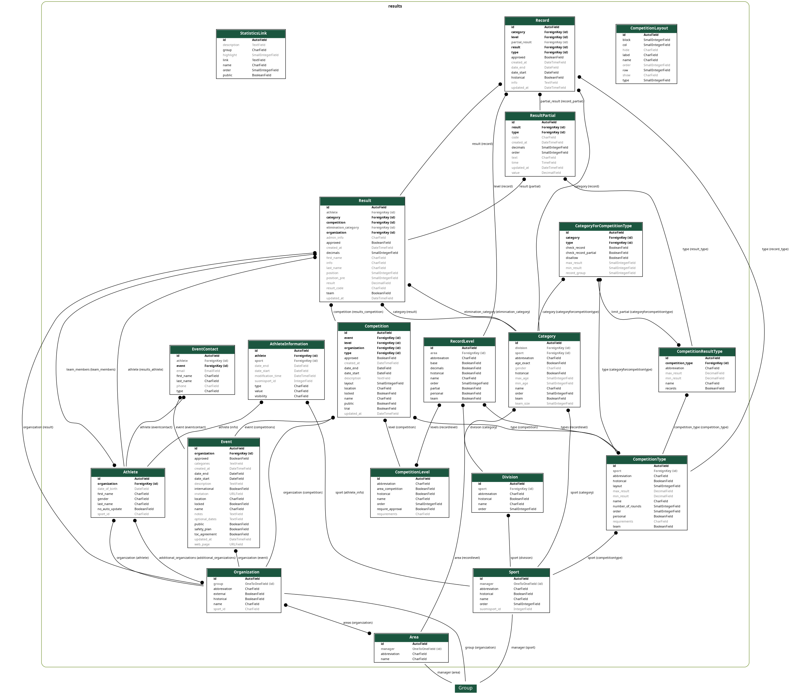

Models
======

   Database structural image

Athlete
--------------
.. autoclass:: results.models.athletes.Athlete
    :members:

AthleteInformation
------------------
.. autoclass:: results.models.athletes.AthleteInformation
    :members:

Category
--------------
.. autoclass:: results.models.categories.Category
    :members:

CategoryForCompetitionType
--------------------------
.. autoclass:: results.models.categories.CategoryForCompetitionType
    :members:

Division
--------------
.. autoclass:: results.models.categories.Division
    :members:

Competition
--------------
.. autoclass:: results.models.competitions.Competition
    :members:

CompetitionLayout
-----------------
.. autoclass:: results.models.competitions.CompetitionLayout
    :members:

CompetitionLevel
----------------
.. autoclass:: results.models.competitions.CompetitionLevel
    :members:

CompetitionResultType
---------------------
.. autoclass:: results.models.competitions.CompetitionResultType
    :members:

CompetitionType
---------------
.. autoclass:: results.models.competitions.CompetitionType
    :members:

Event
--------------
.. autoclass:: results.models.events.Event
    :members:

Area
--------------
.. autoclass:: results.models.organizations.Area
    :members:

Organization
--------------
.. autoclass:: results.models.organizations.Organization
    :members:

Record
--------------
.. autoclass:: results.models.records.Record
    :members:

RecordLevel
--------------
.. autoclass:: results.models.records.RecordLevel
    :members:

Result
--------------
.. autoclass:: results.models.results.Result
    :members:

ResultPartial
--------------
.. autoclass:: results.models.results.ResultPartial
    :members:

Sport
--------------
.. autoclass:: results.models.sports.Sport
    :members:
